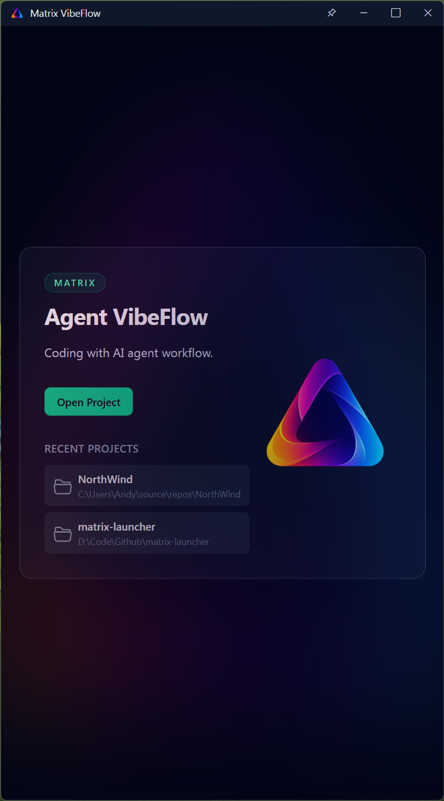
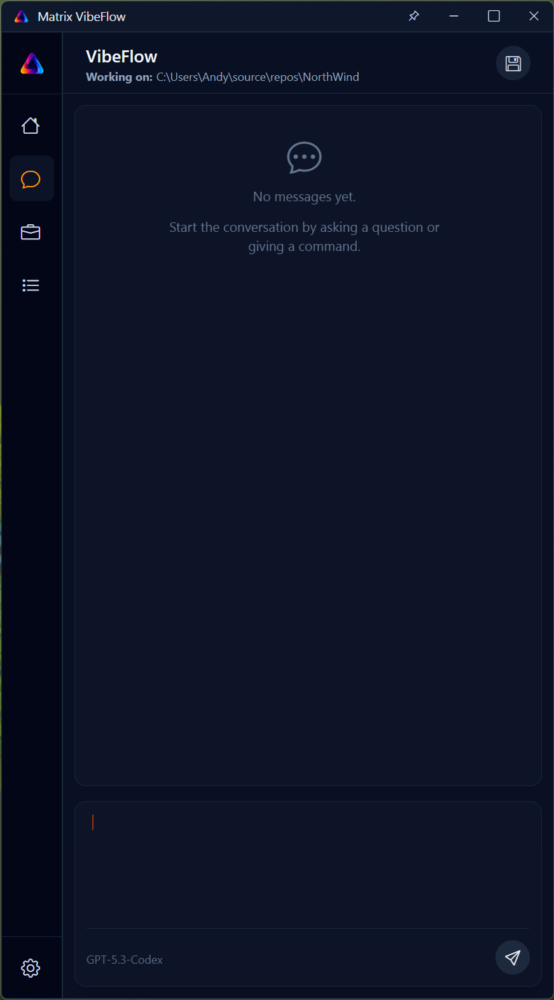
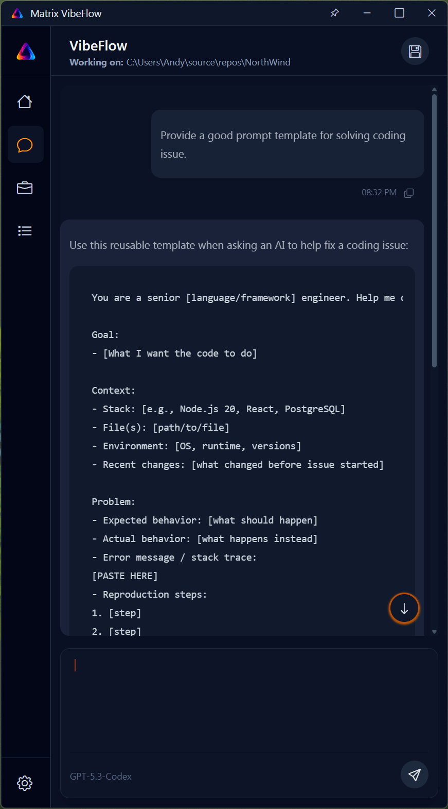
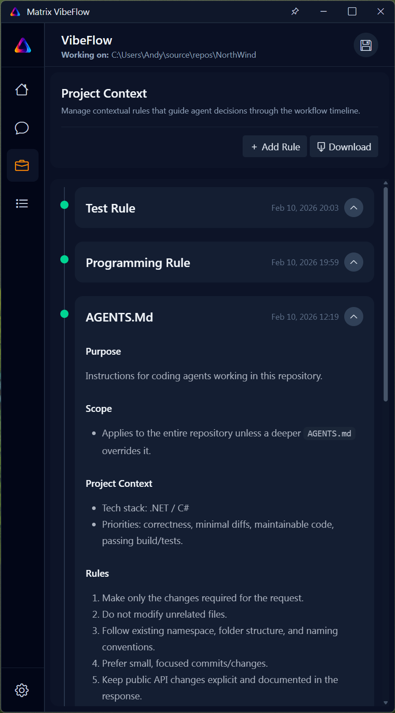
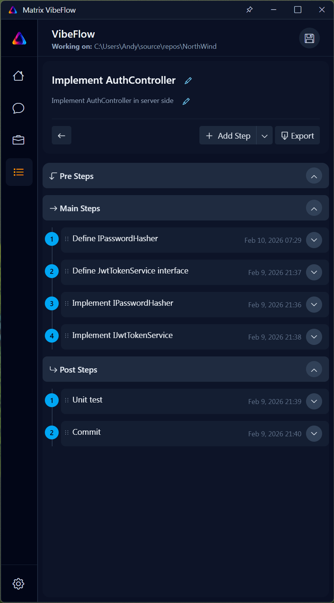
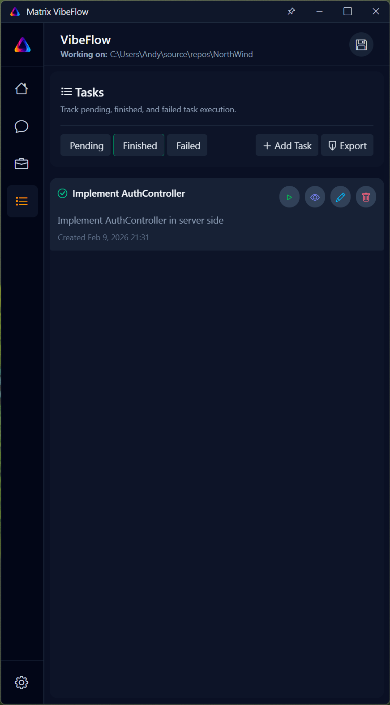
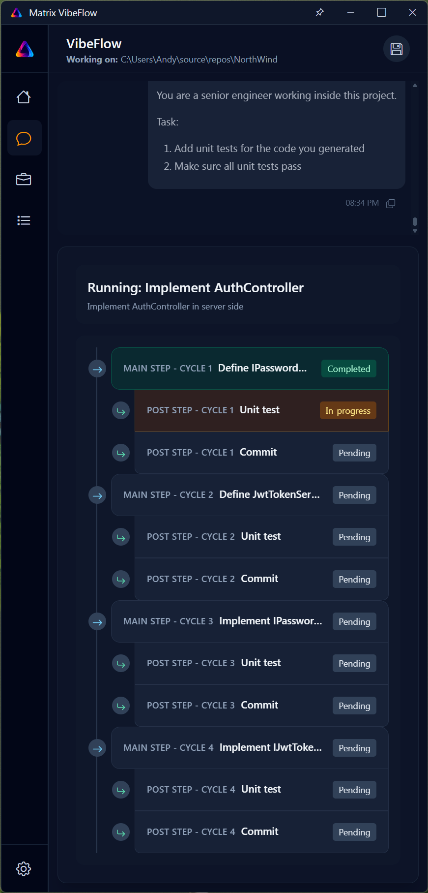

# 🚀 Matrix VibeFlow

**VibeFlow** is an AI-driven developer workflow engine that helps you plan, execute, and evolve complex coding tasks **end-to-end** — with minimal manual intervention.
It tightly integrates with **Codex CLI** to safely modify your project, understand context, and complete large tasks step by step.

Think of VibeFlow as an **AI project executor**, not just a chat assistant.

---

## 🧭 How to Use VibeFlow

1. **Load Project Context**
   VibeFlow scans and manages relevant project files and supplies accurate context to Codex.

2. **Define a Goal**
   Example: *Refactor authentication to support JWT + refresh tokens*

3. **Task Planning**
   The planner breaks the goal into executable steps.

4. **Automated Execution**
   Steps are executed via Codex CLI and applied directly to your project.

5. **Iteration & Completion**
   Post-steps verify results before moving forward.

---

## 🧠 Core Features

### 1. Interactive Codex CLI Integration
- Executes Codex CLI commands directly
- Applies changes inside your repository
- Supports sandboxing and approval policies

### 2. Project Context Management
- Selective file loading
- Reduced token usage
- Consistent architecture and style

### 3. Task Planner (Autonomous Execution)
- Pre-step / Main-step / Post-step workflow
- Minimal human intervention
- Ideal for refactors and migrations

### 4. AI Assistant Prompt Generation
- Optimized prompts with intent, constraints, and output rules
- Repeatable and high-quality instructions

---

## 🗺️ Feature Plan

**Near Term**
- Prompt history
- Support more AI agent CLI

---

## 🤝 How to Contribute

I welcome developers who care about building reliable AI-driven engineering tools.

### Coding Style Preference

VibeFlow codebase **prefers Object-Oriented Programming (OOP)** principles:

- Clear class responsibilities (Single Responsibility Principle)
- Encapsulation of behavior and state
- Interface-based abstractions
- Dependency injection over tight coupling
- Clean separation of planning, execution, and context layers

Please follow existing architecture patterns when contributing.

### Contribution Steps

1. Fork the repository
2. Create a feature branch
3. Follow existing OOP structure and naming conventions
4. Keep changes scoped and well-documented
5. Submit a pull request with clear intent and explanation

---

## 💬 Philosophy

> VibeFlow treats AI as a reliable teammate — not a chat toy.

It focuses on deterministic execution, explicit context, and safe automation.

---

## Screenshots

